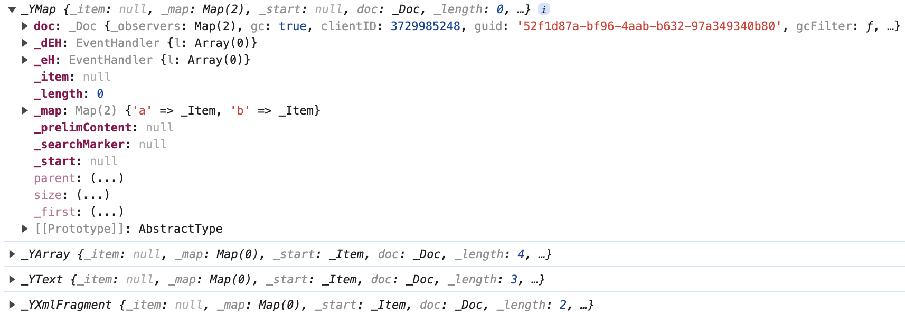
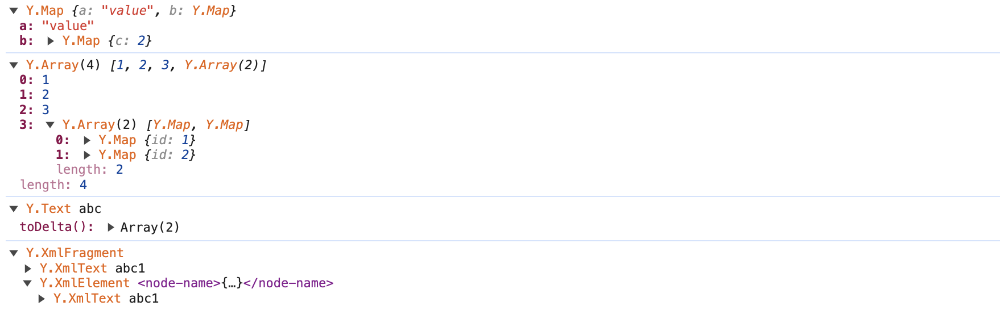

# Chrome DevTools formatter for Yjs

A Chrome DevTools formatter for Yjs.

# Why

Yjs provides many data types similar to primitive data types. However, when developers print Yjs data in Chrome DevTools, they can only see various internal properties of the Yjs data in the console, which is not as intuitive as viewing primitive data types. In this case, this custom formatting tool comes into being. It makes the Yjs data types printed in the Chrome DevTools console easier to read and inspect, allowing developers to inspect Yjs data types just as they do with primitive data types.

Usually, developers will see such a complex display when printing Yjs data:



This tool will format the above content as:



## Features

The library currently has formatters for:

- [x] `Y.Map`
- [x] `Y.Array`
- [x] `Y.Text` & `Y.XmlText`
- [x] `Y.YXmlFragment` & `isYXmlElement`

## Installation

Chrome v47+

In Dev Tools, press F1 to load the Settings. Scroll down to the Console section and tick "Enable
custom formatters".

Then, in your project, install via npm:

```
npm install --save-dev yjs-devtools-formatter
```

And enable with:

```js
import * as Y from 'yjs';

import installDevTools from "yjs-devtools-formatter";

installDevTools(Y);
```

Note: You probably only want this library for debug builds, so perhaps wrap
with `if (process.env.NODE_ENV === 'development') {...}` or similar.

